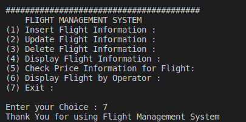

# Flight-Management-System

This is the Capstone Project for Udacity C++ nanodegree. Flight Management System (FMS)
maintanis flight database with flight number, origin city name, destination city name, airfare, flight operator name etc. 

Data and time for a flight is not considered right now. And Assume that flight number is unique in entire database.
FMS can be utilised to get the special request like Average fare from all trips, Maximum airfare for specific operator, 
Get list of flights from city, But it is not a part of FMS main Menu as of now.
FMS provides below features to get the details from flight database.

1. Insert Flight Information : 
2. Update Flight Information : 
3. Delete Flight Information : 
4. Display Flight Information :
5. Check Price Information for Flight :
6. Display Flight by Operator :
7. Exit :

FMS takes input from user for above displayed menu and perform operations on the already stored flight database. By default FMS has 6 records in flight database.

## Dependencies for Running Locally
* cmake >= 3.11
  * All OSes: [click here for installation instructions](https://cmake.org/install/)
* make >= 4.1 (Linux, Mac), 3.81 (Windows)
  * Linux: make is installed by default on most Linux distros
  * Mac: [install Xcode command line tools to get make](https://developer.apple.com/xcode/features/)
  * Windows: [Click here for installation instructions](http://gnuwin32.sourceforge.net/packages/make.htm)
* gcc/g++ >= 5.4
  * Linux: gcc / g++ is installed by default on most Linux distros
  * Mac: same deal as make - [install Xcode command line tools](https://developer.apple.com/xcode/features/)
  * Windows: recommend using [MinGW](http://www.mingw.org/)
  
## Basic Build Instructions
* Clone this repo.
* Make a build directory in the top level directory: mkdir build && cd build
* Compile: cmake .. && make
* Run it: ./flight_management

## Future Scope
* Airport Staff operations
* Runway availaibility
